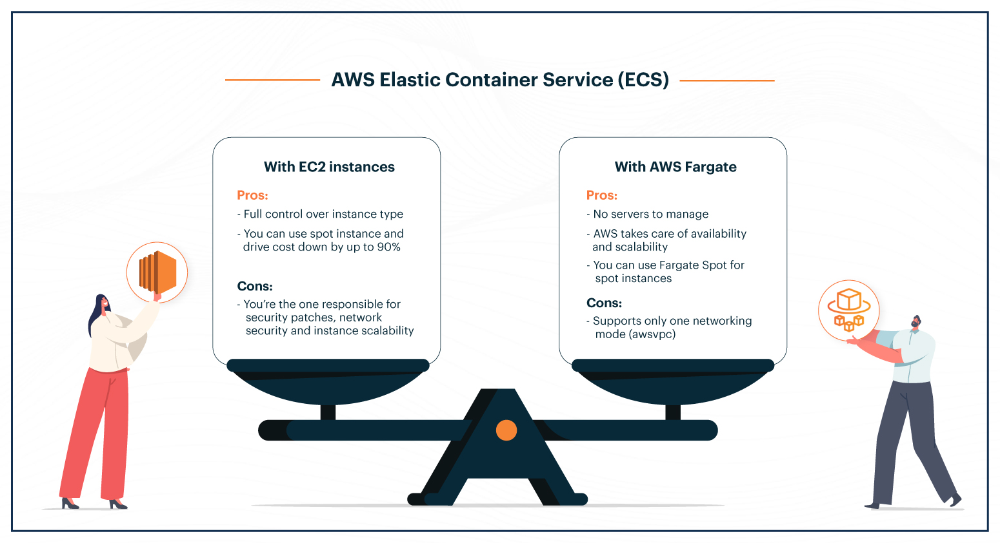

## AWS ECS – Elastic Container Service - Intermediate - Usecases

- Amazon Elastic Container Service (Amazon ECS) is a highly scalable, fast container management service that makes it easy to run, stop, and manage containers on a cluster. ECS comes with two launch types: EC2 and Fargate. The containers can run on a serverless infrastructure that is managed by AWS Fargate. Alternatively, for more control over your infrastructure, you can run your tasks and services on a cluster of Amazon EC2 instances that you manage. The containers can run on a serverless infrastructure that is managed by AWS Fargate. Alternatively, for more control over your infrastructure, you can run your tasks and services on a cluster of Amazon EC2 instances that you manage.

- You can schedule the placement of your containers across your cluster based on your resource needs, isolation policies, and availability requirements. With Amazon ECS, you don’t have to operate your own cluster management and configuration management systems or worry about scaling your management infrastructure.

- AWS Fargate removes the need to provision and manage servers. Instead, you simply specify the resources per task, which also improves security through application isolation by design.

- With AWS Fargate, you don’t have to provision, configure, or scale groups of virtual machines on your own to run containers. You also don’t need to choose server types, decide when to scale your node groups, or optimize cluster packing. You can control which pods start on Fargate and how they run with Fargate profiles.

## Use Case 1 :

